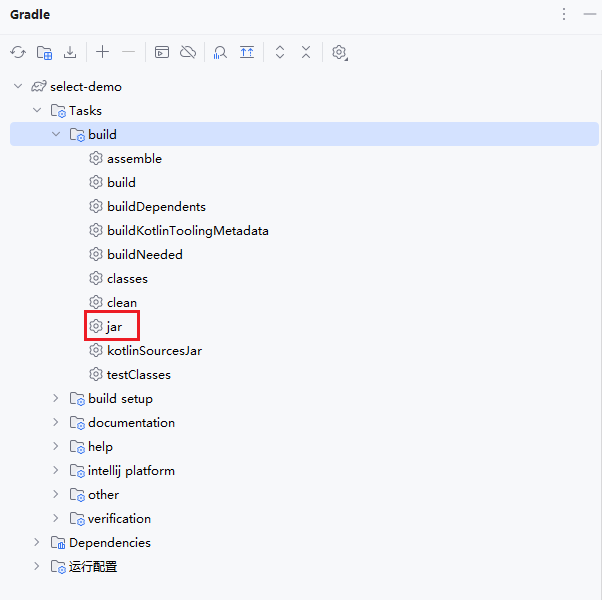
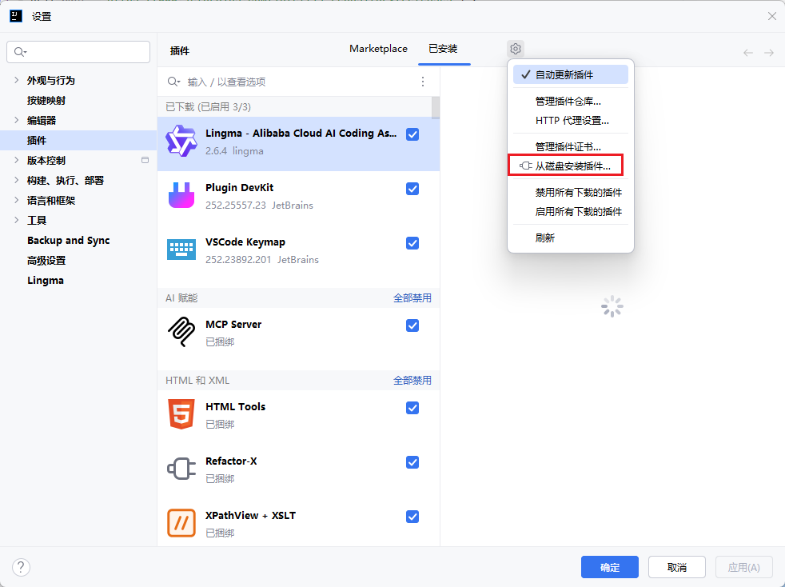

# 插件开发

cb889fc7b3274f38b95e16d1e371878b.k9lERpnBytWFEcT7

## 环境配置

* 下载 IDEA 社区版/企业版
* 下载 Plugin DevKit 插件
* 新建项目，选择类型 `IDE 插件`
* 点击 `Gradle` 图标构建Gradle，完成后会生成 `.gradle`,`.intelljPlatfrom`,`build`三个文件夹
* 将 `src/main/kotlin`文件夹改为 `src/main/java`

## 重要说明

* `build.gradle.kts`：配置文件，我的IDEA创建的默认设置可以直接跑
* `src/main/resources/MAIN-INF/plugin.xml`：插件信息，包括了插件的id `<id>`、名称 `<name>`、开发者信息 `<vendor>`、描述 `<description>`
* 在 `src/main/java/*`文件夹内创建操作类action后，需要在 `plugin.xml`文件中添加信息，举例：

```xml
    <actions>
        <action id="SelectAction" class="com.example.demo.SelectAction" text="SelectAction"
                description="SelectAction">
            <add-to-group group-id="ToolsMenu" anchor="first"></add-to-group>
        </action>
    </actions>
```

* 说明
  * id：操作的id
  * class：操作的类，要和目录结构一致
  * text：操作名称
  * description：操作描述
  * add-to-group：操作添加的位置，此处的含义是添加到在“工具”菜单项的最上层（在IDEA页面，按下ctrl+alt+鼠标左键可以查看具体UI位置的信息）（不过这部分建议直接问AI）

## 打包插件

* 点击 `Gradle` 图标，打开 `build` 文件夹，点击 `jar`，开始打包插件
* 打包完成后，会输出 `执行完成 'jar'`，此时在 `build\libs` 文件夹下可以找到打包的插件



## 安装插件

* 打开插件仓库，点击设置按钮，选择“从磁盘安装插件”，选择对应的jar包进行安装



## 发布插件

* [进入jetbrains插件开发平台](https://plugins.jetbrains.com/developers/intellij-platform)，注册账号
* 点击Upload Plugin上传插件，上传插件jar包，编写相关信息
* 上传成功，等待审核
